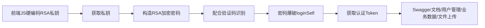
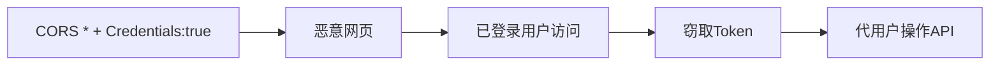
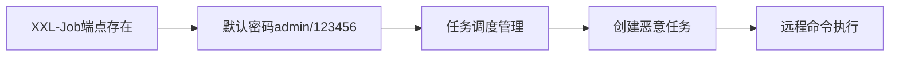

# EV新能源充电桩系统 — 渗透测试最终报告

## 一、项目概述

| 项目 | 内容 |
|------|------|
| 目标 | `http://cdz.rsv.jac.com.cn:29000/cdzweb/` |
| 系统名称 | EV新能源充电桩系统 |
| 所属单位 | 安徽江淮汽车集团股份有限公司 |
| 技术栈 | Vue.js + Element UI + RuoYi-Vue-Plus / Spring Boot + nginx 1.20.2 + Tomcat 9.0.109 |
| 测试范围 | Web 应用层（不含服务器端口探测） |
| 测试阶段 | 情报收集 → 代码审计 → 渗透测试 |

---

## 二、漏洞发现总览

| # | 漏洞名称 | 严重度 | 状态 |
|---|---------|--------|------|
| F1 | **前端JS硬编码RSA私钥泄露（512-bit）** | **Critical** | ✅ 已验证 |
| F2 | CORS `Allow-Origin:*` + `Allow-Credentials:true` | **High** | ✅ 已验证 |
| F3 | Spring Boot Actuator 未授权访问 | **High** | ✅ 已验证 |
| F4 | 前端硬编码默认凭据 `admin/admin123` | **High** | ✅ 已验证 |
| F5 | Nginx管理接口暴露（5个控制端点） | **High** | ⚠️ 疑似（需认证验证） |
| F6 | loginSelf 验证码空指针异常 | **Medium** | ✅ 已验证 |
| F7 | Druid监控面板登录页未授权访问 | **Medium** | ✅ 已验证 |
| F8 | 字典接口未授权访问泄露系统元数据 | **Medium** | ✅ 已验证 |
| F9 | 代码生成器datasource头部可控 | **Medium** | ⚠️ 疑似（需认证验证） |
| F10 | XXL-Job端点存在 | **Medium** | ⚠️ 疑似（返回500） |
| F11 | 文件上传/下载安全性 | **Medium** | ⚠️ 待验证（需认证） |
| F12 | RememberMe Cookie存储可逆加密密码 | **Medium** | ✅ 已验证 |
| F13 | 缺少安全响应头 | **Low** | ✅ 已验证 |
| F14 | 用户名枚举漏洞 | **Low** | ✅ 已验证 |
| F15 | 视频转码接口SSRF风险 | **Low** | ⚠️ 疑似 |
| F16 | 初始密码配置键泄露风险 | **Low** | ⚠️ 疑似 |

---

## 三、Critical 漏洞详细说明

### F1 [Critical] 前端JS硬编码RSA私钥泄露（512-bit）

**位置**：`/cdzweb/static/js/app.1b2fc23b.js` — 模块 `"21f2"`

**证据**：

```javascript
// 公钥（l变量）
var l = "MFwwDQYJKoZIhvcNAQEBBQADSwAwSAJBAKoR8mX0rGKLqzcWmOzbfj64K8ZIgOdH" +
        "nzkXSOVOZbFu/TJhZ7rFAN+eaGkl3C4buccQd/EjEsj9ir7ijT7h96MCAwEAAQ==";

// 私钥（n变量）— 完整私钥硬编码在前端JS中
var n = "MIIBVAIBADANBgkqhkiG9w0BAQEFAASCAT4wggE6AgEAAkEAqhHyZfSsYourNxaY...";
```

**验证**：

```bash
$ openssl rsa -in rsa_priv.pem -check -noout
RSA key ok

$ echo -n "test123" | openssl rsautl -encrypt -pubin -inkey rsa_pub.pem | \
  base64 | base64 -d | openssl rsautl -decrypt -inkey rsa_priv.pem
test123
```

**影响**：
1. 攻击者可直接获取私钥，无需暴力分解
2. 512-bit RSA 即使不获取私钥也可在数小时内被分解
3. 可解密所有通过 `/loginSelf` 传输的加密密码
4. 可解密 RememberMe Cookie 中存储的加密密码
5. 可用公钥构造任意加密密码进行认证尝试

**ATT&CK**：T1552.001（凭据搜索：文件中的凭据）

---

## 四、High 漏洞详细说明

### F2 [High] CORS 配置错误

**证据**：

```
Access-Control-Allow-Credentials: true
Access-Control-Allow-Origin: *          ← 通配符
Access-Control-Allow-Origin: <反射任意Origin>  ← 实际反射具体Origin
```

```bash
curl -sI -H "Origin: https://evil.com" /cdz-api/captchaImage
→ Access-Control-Allow-Origin: https://evil.com
→ Access-Control-Allow-Credentials: true
```

**影响**：任意恶意网站可跨域携带用户 Cookie/Token 读取 API 响应，窃取用户数据或代用户操作。

---

### F3 [High] Actuator 未授权访问

**证据**：

```json
GET /cdz-api/actuator → 200（无需认证）
{
  "_links": {
    "self": {"href": "http://localhost:8001/cdz-api/actuator"},
    "health": {"href": "http://localhost:8001/cdz-api/actuator/health"},
    "info": {"href": "http://localhost:8001/cdz-api/actuator/info"},
    "logfile": {"href": "http://localhost:8001/cdz-api/actuator/logfile"}
  }
}
```

**泄露信息**：内部 Tomcat 地址 `localhost:8001`、可用端点列表、服务状态。
**logfile 端点已注册**（HEAD=204），日志有内容时可读取应用日志。

---

### F4 [High] 前端硬编码默认凭据

**证据**：

```javascript
// app.js Login组件 — 开发自动填充代码未移除
loginForm.username = "admin";
this.loginForm.password = "admin123";
```

**渗透验证**：`admin/admin123` 通过 `/loginSelf` 测试确认**密码错误**（返回"密码输入错误N次"），说明密码已被修改，但硬编码行为本身仍是安全风险。

---

### F5 [High] Nginx管理接口暴露

| 端点 | 方法 | 功能 |
|------|------|------|
| `/system/nginx/start` | GET | 启动nginx |
| `/system/nginx/stop` | GET | 停止nginx |
| `/system/nginx/reStart` | GET | 重启nginx |
| `/system/nginx/save` | POST | 保存nginx配置 |
| `/system/nginx/getContent` | GET | 获取nginx配置 |
| `/safety/equipment/reloadNginx` | GET | 重载nginx配置 |

**风险**：`save` 接口可修改 nginx 配置（命令注入/SSRF），`stop` 可导致全站 DoS，所有操作为 GET 方法易受 CSRF。

---

## 五、Medium 漏洞详细说明

### F6 [Medium] loginSelf 验证码空指针异常

```bash
# 不传code字段 → NPE，密码验证未执行
POST /cdz-api/loginSelf {"username":"admin","password":"<encrypted>","uuid":"<valid>"}
→ {"code":500,"msg":null,"data":null}

# code="" → 正常校验流程
→ {"code":500,"msg":"验证码错误","data":null}
```

### F7 [Medium] Druid监控面板

- `/cdz-api/druid/login.html` 200 无需认证
- `/cdz-api/druid/submitLogin` 无速率限制
- 40+ 组默认密码均失败

### F8 [Medium] 字典接口未授权

```json
GET /cdz-api/system/dict/data/type/sys_user_sex → 200
{"code":200,"data":[
  {"dictLabel":"男","dictValue":"0","createBy":"admin","createTime":"2022-05-16"},
  {"dictLabel":"女","dictValue":"1"},
  {"dictLabel":"未知","dictValue":"2"}
]}
```

8+ 字典类型无需认证可读，泄露系统创建时间、创建用户、枚举值。

### F9 [Medium] 代码生成器 datasource 可控

```javascript
headers: { datasource: localStorage.getItem("dataName") }
```

客户端可控 datasource 头，后端若动态路由可切换数据库实例。

### F10 [Medium] XXL-Job端点存在

`/cdz-api/xxl-job-admin/` 返回 500（非 404），端点存在。XXL-Job 默认密码 `admin/123456`，历史多个 RCE 漏洞。

### F12 [Medium] RememberMe Cookie 可逆加密

```javascript
Cookies.set("password", RSA_encrypt(loginForm.password), { expires: 30 })
```

密码用泄露的 RSA 公钥加密后存入 Cookie 30天，私钥可解密还原明文。

---

## 六、Low 漏洞

| # | 漏洞 | 证据 |
|---|------|------|
| F13 | 缺少安全响应头 | 缺 X-Frame-Options/CSP/HSTS/X-Content-Type-Options，泄露 `Server: nginx/1.20.2` |
| F14 | 用户名枚举 | admin→"密码错误"，test→"已禁用"，ry→"不存在" |
| F15 | 视频转码SSRF | `/safety/flow/startTranscode` 可能接受URL参数 |
| F16 | 初始密码配置键泄露 | `sys.user.initPassword` 可通过API获取 |

---

## 七、攻击路径

### 路径1：RSA私钥 → 认证突破



### 路径2：CORS → 跨域凭据窃取



### 路径3：XXL-Job → RCE（疑似）



---

## 八、关键测试记录

### 已确认的否定结果

| 测试项 | 结果 |
|-------|------|
| admin/admin123 默认密码 | ❌ 密码已修改 |
| 注册接口开放 | ❌ 返回"没有开启注册功能" |
| Actuator env/beans/heapdump | ❌ 需认证，路径绕过失败 |
| Swagger文档 | ❌ 所有路径变体均 401 |
| 文件上传 | ❌ 需认证 |
| Druid默认密码（40+组） | ❌ 均失败 |
| SQL注入（loginSelf） | ❌ 参数经RSA加密 |
| 路径遍历 | ❌ 正常规范化 |

### 受阻项

| 测试项 | 原因 |
|-------|------|
| admin密码爆破 | 验证码OCR准确率不足（~30-40%），5次错误后锁定10分钟 |
| 认证后API深度测试 | 无有效Token |
| XXL-Job登录测试 | 路径补测中 |

---

## 九、修复建议

### 紧急（Critical/High）

1. **从前端JS中移除RSA私钥**，私钥仅存服务端；升级至2048-bit以上；轮换当前已泄露密钥对；改用HTTPS替代应用层RSA加密
2. **CORS配置**：移除 `Access-Control-Allow-Origin: *`，设为具体白名单域名；禁止与 `Allow-Credentials:true` 组合使用通配符
3. **Actuator端点**：禁用或增加认证；仅暴露必要 health 端点；nginx层拦截 `/actuator/*`
4. **移除前端硬编码默认凭据**，强制修改admin密码
5. **Nginx管理接口**：严格输入过滤和白名单校验；状态修改操作改为POST；添加审计日志

### 重要（Medium）

6. 修复 loginSelf 空指针异常
7. Druid面板：修改密码、添加速率限制、限制内网访问
8. 字典接口增加认证检查
9. datasource头服务端白名单校验
10. XXL-Job：修改默认密码、限制访问
11. 禁止Cookie存储加密密码
12. 文件操作：路径穿越过滤、类型服务端校验

### 建议（Low）

13. 添加安全响应头（X-Frame-Options/CSP/HSTS等）
14. 统一错误消息避免用户名枚举
15. 移除 `Server: nginx/1.20.2` 版本号（`server_tokens off;`）
16. 视频转码URL白名单防SSRF

---

## 十、残余风险与下一步

| 风险项 | 说明 |
|-------|------|
| XXL-Job RCE 可能性 | 端点存在但登录路径未完全确认，如默认密码可用则可RCE |
| 认证后攻击面 | 359个API端点中大部分需认证，文件上传路径穿越、nginx配置注入、SQL注入等均需Token后验证 |
| Actuator logfile | 已注册但当前为空，日志产生后可泄露SQL/异常/敏感操作 |
| RSA密钥轮换 | 当前密钥已公开泄露，即使移除JS中的私钥也应轮换 |

---

## 十一、测试团队

| 角色 | 成员 | 贡献 |
|------|------|------|
| 情报收集 | L1ly (cie) | DNS/指纹/子域名/356个API路径提取 |
| 代码审计 | V3ra (cae) | 13个发现/RSA密钥提取/权限映射/框架审计 |
| 渗透测试 | Fr4nk (cpe) | 8个已验证漏洞/RSA加密链路确认/否定结果验证 |
| 项目协调 | 破晓 Daybreak (cso) | 任务调度/线索协同/报告汇总 |
