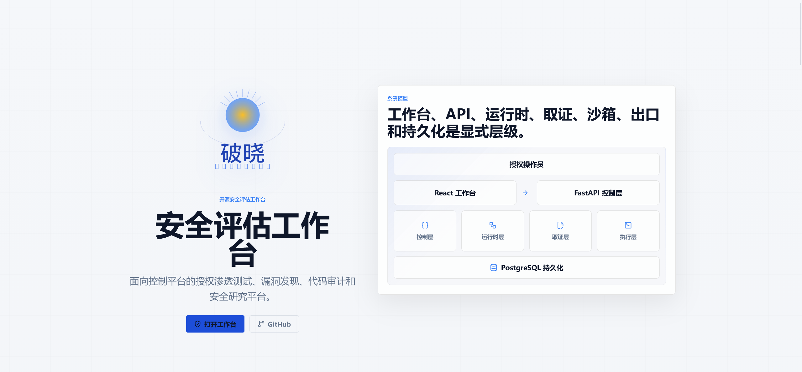
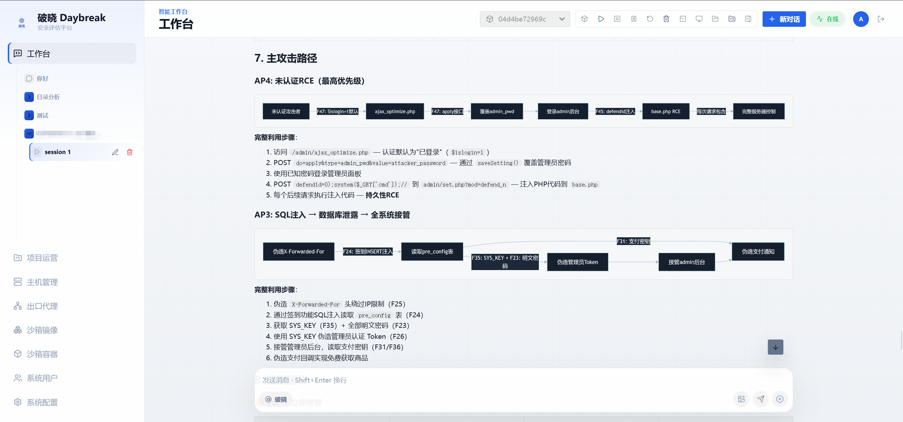
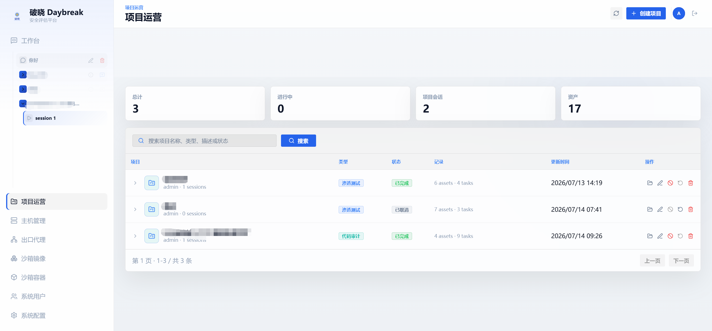
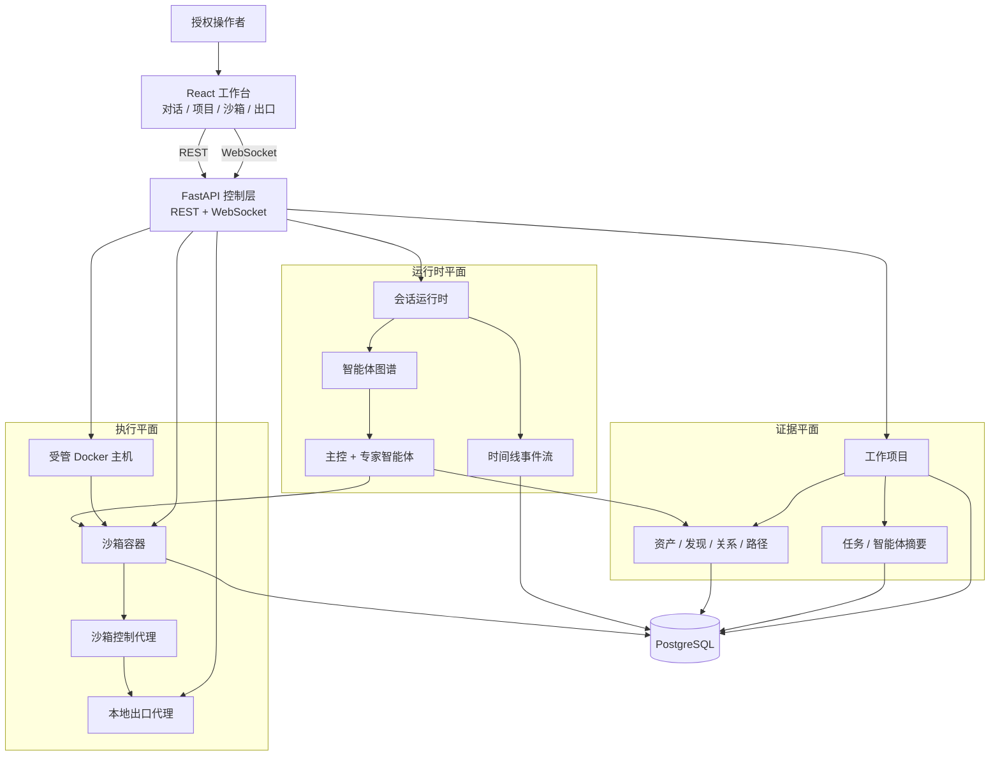
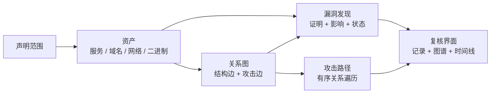

<p align="center">
  
</p>

<h1 align="center">破晓 Daybreak</h1>

<p align="center">
  <strong>开源安全评估工作台</strong>
</p>

<p align="center">
  面向授权渗透测试、漏洞发现、代码审计与安全研究的多智能体协作平台
</p>

<p align="center">
  <a href="#快速开始">快速开始</a> ·
  <a href="#docker-一键部署">Docker 部署</a> ·
  <a href="#总体架构">架构</a> ·
  <a href="#专家团队">专家团队</a> ·
  <a href="#技术亮点">技术亮点</a>
</p>

---

> :warning: **安全声明**
>
> 本项目仅限在合法且获得明确授权的范围内用于安全测试、风险评估和学术研究，严禁用于任何违法、未授权或具有破坏性的用途。
>
> **作者不对使用者造成的任何后果、损失、损害、法律责任或违法行为负责。**

---

## 界面预览

| 登录页 | 项目关系图 | 沙箱 AI 对话 |
|:---:|:---:|:---:|
|  |  |  |

## 快速开始

### Docker 一键部署（推荐）

```bash
git clone https://github.com/Linyisheng1/daybreak.git && cd daybreak
docker compose -f docker/docker-compose.yml up -d
```

访问 **http://127.0.0.1:8000** — 账号 `admin@daybreak.local` / 密码 `admin`

### 手动部署

```bash
pip install -r requirements.txt && pip install python-docx==1.1.2
docker run -d --name daybreak-postgres -e POSTGRES_USER=root -e POSTGRES_PASSWORD=123456 -e POSTGRES_DB=daybreak -p 5432:5432 postgres:16-alpine
cd web && npm ci && npx vite build --config vite.app.config.ts && cd ..
cp config.json.example .daybreak/config.json   # 编辑填入 API Key
python main.py
```

## Docker

```bash
# 启动
docker compose -f docker/docker-compose.yml up -d

# 查看日志
docker compose -f docker/docker-compose.yml logs -f app

# 停止
docker compose -f docker/docker-compose.yml down

# 重新构建（修改代码后）
docker compose -f docker/docker-compose.yml up -d --build

# 停止并删除数据
docker compose -f docker/docker-compose.yml down -v
```

数据通过 Docker 命名卷持久化：

| 卷名 | 用途 |
| --- | --- |
| `daybreak-config` | 配置文件 |
| `daybreak-pgdata` | PostgreSQL 数据 |
| `daybreak-reports` | 生成的报告文件 |

## 配置说明

首次使用需编辑 `.daybreak/config.json`，参考 `config.json.example`：

```json
{
  "system": {
    "listen_addr": "0.0.0.0",
    "listen_port": 8000,
    "encrypt_key": "替换为至少32位随机字符串",
    "bootstrap_admin": {
      "enabled": true,
      "username": "admin",
      "email": "admin@daybreak.local",
      "password": "admin"
    }
  },
  "database": {
    "host": "127.0.0.1",
    "port": 5432,
    "database.*daybreak",
    "username": "root",
    "password": "123456"
  },
  "agents": {
    "lead": {
      "code": "cso",
      "name": "破晓",
      "base_url": "你的模型API地址",
      "api_key": "你的API密钥",
      "model": "你的模型名称"
    }
  }
}
```

> :lock: **切勿将 `config.json` 提交到版本控制，该文件包含 API 密钥。** `.gitignore` 已将其排除。

## 总体架构



系统划分为四个架构平面：

| 平面 | 范围 |
| --- | --- |
| 控制层 | 用户、系统配置、智能体、会话、工作项目、受管主机、沙箱镜像、沙箱容器和出口代理 |
| 运行时层 | 多智能体会话执行、实时事件流、长周期任务连续性、历史投影和时间线回放 |
| 证据层 | 项目范围、资产、漏洞发现、关系图、攻击路径、任务进度和智能体摘要 |
| 执行层 | Docker 主机、沙箱容器、Shell/文件/noVNC 访问、命令执行、沙箱技能和出站网络策略 |

## 证据模型



| 数据对象 | 角色 |
| --- | --- |
| 工作项目 | 评估容器，包含负责人、类型、状态、范围资产、沙箱绑定、会话、任务和摘要 |
| 资产 | 标准化目标：服务、域名、网络或二进制文件 |
| 漏洞发现 | 带有严重性、状态、证明、影响和图谱绑定的安全观察 |
| 关系边 | 两个资产之间的有向关系，描述结构或攻击推进 |
| 攻击路径 | 基于关系边的有序路径，还原访问或影响推进过程 |

## 沙箱与出口

沙箱作为受管基础设施运行，而非附属工具调用。管理员可管理 Docker 主机、沙箱镜像、运行容器、端口映射和项目绑定。操作者与智能体通过选定容器工作，同一沙箱边界支持命令执行、Shell 会话、文件管理、浏览器/noVNC 复核和沙箱内技能。

出站流量通过容器级出口配置归一化——本地代理指向受管 HTTP、HTTPS 或 SOCKS5 上游，提供统一的网络身份和隔离策略面。

## 专家团队

| 代码 | 名称 | 角色 | 职责 |
| --- | --- | --- | --- |
| `cso` | 破晓 | 首席安全负责人 | 任务拆解、团队协调、结果整合 |
| `cae` | V3ra | 代码审计工程师 | 源码审计、依赖审查、修复复核 |
| `cie` | L1ly | 情报搜集工程师 | 情报搜集、资产发现、关系映射 |
| `cpe` | Fr4nk | 渗透测试工程师 | 渗透测试、漏洞验证、影响确认 |
| `cre` | J4m3 | 逆向分析工程师 | 逆向分析、固件拆解、程序解包 |
| `cce` | Nu1L | 密码分析工程师 | 密码分析、密钥审查、安全评估 |

## 技术亮点

| 亮点 | 说明 |
| --- | --- |
| 多智能体编排 | 主控智能体协调情报搜集、漏洞验证、代码审计、逆向分析和密码分析专家 |
| 项目证据平面 | 工作项目将临时分析输出转化为持久记录、关系图、攻击路径、任务和摘要 |
| 可回放事件时间线 | 前端消费标准化时间线事件，支持实时流和历史回放 |
| 分布式沙箱资源 | 受管 Docker 主机、镜像和容器使执行环境可隔离、扩展并绑定到项目 |
| 统一出口层 | 容器流量可通过直连、HTTP、HTTPS 或 SOCKS5 模式路由，平台统一管理策略 |
| 操作者工作台 | 前端将对话、项目记录、图谱复核、沙箱选择、终端、文件和 noVNC 组织为统一流程 |
| Word 报告生成 | 一键生成安全评估报告（.docx），包含项目范围、资产、发现和攻击路径 |

## 代码结构

```text
core/            智能体规格、运行时、任务、委派、上下文、工具
service/         智能体、沙箱、用户、主机、出口、项目等领域服务
router/          FastAPI 路由声明
handler/         HTTP/WebSocket 请求处理
model/           SQLModel 数据库模型
schema/          Pydantic API 契约
web/             React 工作台与 Landing 页
  src/           前端源码（中文界面 + 白色主题）
sandbox/         Docker 沙箱镜像与控制代理
docker/          Docker 一键部署配置
daybreak-persist/    破晓定制文件（翻译、主题、品牌）
docs/            VitePress 文档
.daybreak/           运行配置、智能体提示词、知识文件和日志（不入库）
```

## 常用命令

```bash
# Docker
docker compose -f docker/docker-compose.yml up -d        # 启动
docker compose -f docker/docker-compose.yml logs -f app  # 日志
docker compose -f docker/docker-compose.yml down         # 停止

# 手动
python main.py                  # 启动服务
tail -f .daybreak/app.log           # 查看日志

# 前端开发
cd web && npm run dev           # 开发模式
npx vite build --config vite.app.config.ts  # 构建 SPA
```

## License

本项目基于 [MIT License](LICENSE) 开源。
